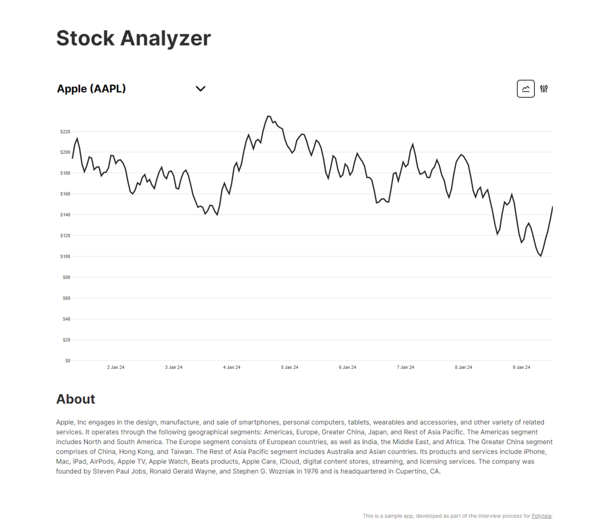

## Polyteia Challenge

### Start-Up

Run `docker compose -f=docker-compose.dev.yml up -d` to start up a `mongodb` instance.

Run `npm i && npm run dev` to start both the frontend as well as the backend.
The database will be seeded with some data.

You can now visit http://localhost:1234 to access the frontend. The backend is proxied to `/api`.

Setup prettier as necessary.

### Requirements

The challenge consists of two parts: the back-end and the front-end.
The back-end part of the challenge will be a NestJS application that will expose two GraphQL queries:

- first one outputs numeric data extracted from a pre-populated database, the exact DBMS is up to you;
- the second outputs random numeric data.

**Apollo** is the recommended GraphQL library, but please feel free to use any other one.
The front-end part will be a **React** application that queries and displays the data returned by the back-end as a graph, e.g. as a line chart, bar chart, etc.
Feel free to use any visualization library that you choose, e.g. **Nivo**. The interface will allow to:

- query new batch of data from the back-end;
- switch the type of the graph, e.g. from a line chart to a bar chart.

Test coverage is, of course, not required.
